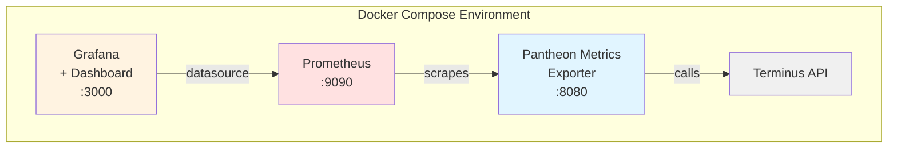

# Docker Compose Setup

This guide explains how to run the Pantheon Metrics Exporter with Prometheus and Grafana using Docker Compose.

## Quick Start

Get up and running in 3 simple steps:

```bash
# 1. Copy the environment template
cp .env.example .env

# 2. Edit .env and add your Pantheon machine token(s)
vim .env  # or use your favorite editor

# 3. Start all services
docker compose up -d
```

That's it! The services are now running and metrics are being collected.

## Accessing the Services

Once the containers are running, access the services at:

- **Pantheon Metrics Exporter**: http://localhost:8080
  - Metrics endpoint: http://localhost:8080/metrics

- **Prometheus**: http://localhost:9090
  - Explore metrics, run queries, view targets

- **Grafana**: http://localhost:3000
  - Default credentials: `admin` / `admin`
  - Pre-loaded dashboard: "Pantheon Metrics Overview"

## Architecture



## Prerequisites

- Docker Engine
- Docker Compose
- Pantheon machine token(s) - [Create one here](https://dashboard.pantheon.io/account/machine-tokens)

## Configuration

### Environment Variables

Edit the `.env` file to configure the exporter:

```bash
# Required: Your Pantheon machine tokens (space-separated for multiple accounts)
PANTHEON_MACHINE_TOKENS=token1 token2

# Optional: Environment to monitor (default: live)
PANTHEON_ENV=live

# Optional: Refresh interval in minutes (default: 60)
REFRESH_INTERVAL=60

# Optional: Grafana admin credentials (default: admin/admin)
GRAFANA_ADMIN_USER=admin
GRAFANA_ADMIN_PASSWORD=admin
```

### Monitoring Different Environments

To monitor different Pantheon environments, change the `PANTHEON_ENV` variable:

```bash
# Monitor dev environment
PANTHEON_ENV=dev

# Monitor test environment
PANTHEON_ENV=test

# Monitor a multidev environment
PANTHEON_ENV=my-multidev
```

## Docker Compose Commands

### Start Services

```bash
# Start all services in detached mode
docker compose up -d

# Start and view logs
docker compose up

# Start specific service
docker compose up -d grafana
```

### View Logs

```bash
# View all logs
docker compose logs

# Follow logs in real-time
docker compose logs -f

# View logs for specific service
docker compose logs -f pantheon-exporter

# View last 100 lines
docker compose logs --tail=100 pantheon-exporter
```

### Stop Services

```bash
# Stop all services (preserves data)
docker compose stop

# Stop and remove containers (preserves volumes)
docker compose down

# Stop and remove everything including volumes (DELETES DATA)
docker compose down -v
```

### Restart Services

```bash
# Restart all services
docker compose restart

# Restart specific service
docker compose restart pantheon-exporter
```

### Rebuild After Code Changes

```bash
# Rebuild the exporter image
docker compose build pantheon-exporter

# Rebuild and restart
docker compose up -d --build pantheon-exporter
```

## Using the Pre-loaded Dashboard

The "Pantheon Metrics Overview" dashboard is automatically provisioned when Grafana starts.

### Accessing the Dashboard

1. Open Grafana at http://localhost:3000
2. Login with credentials (default: admin/admin)
3. Navigate to **Dashboards** → **Pantheon Metrics Overview**

### Dashboard Features

The pre-loaded dashboard includes:

- **Summary Stats**: Total visits, pages served, cache hit ratio, site count
- **Visits by Site**: Time series graph showing visitor trends
- **Pages Served by Site**: Track page serving over time
- **Cache Hit Ratio**: Monitor cache efficiency for each site
- **Cache Hits vs Misses**: Stacked area chart comparison
- **Sites by Visits**: Table ranking sites by traffic
- **Sites by Cache Efficiency**: Table ranking cache performance

### Customizing the Dashboard

The dashboard can be customized in Grafana:

1. Click the **⚙️ Settings** icon in the top right
2. Make your changes
3. Click **Save dashboard**

Your changes are persisted in the `grafana-data` Docker volume.

## Prometheus Queries

Access Prometheus at http://localhost:9090 to run custom queries:

### Example Queries

```promql
# Total visits across all sites
sum(pantheon_visits)

# Visits for a specific site
pantheon_visits{name="mysite"}

# Average cache hit ratio
avg(pantheon_cache_hit_ratio)

# Sites with cache hit ratio below 50%
pantheon_cache_hit_ratio < 50

# Total pages served per account
sum by (account) (pantheon_pages_served)

# Rate of visits over 5 minutes
rate(pantheon_visits[5m])
```

## Data Persistence

Data is persisted in Docker volumes:

- `prometheus-data`: Stores Prometheus time-series data
- `grafana-data`: Stores Grafana dashboards and settings

To view volumes:

```bash
docker volume ls | grep pantheon
```

To backup data:

```bash
# Backup Prometheus data
docker run --rm -v pantheon-metrics-prometheus_prometheus-data:/data -v $(pwd):/backup alpine tar czf /backup/prometheus-backup.tar.gz -C /data .

# Backup Grafana data
docker run --rm -v pantheon-metrics-prometheus_grafana-data:/data -v $(pwd):/backup alpine tar czf /backup/grafana-backup.tar.gz -C /data .
```

## Troubleshooting

### Services Won't Start

Check if ports are already in use:

```bash
# Check if ports are available
lsof -i :8080  # Exporter
lsof -i :9090  # Prometheus
lsof -i :3000  # Grafana

# Or use netstat
netstat -tuln | grep -E '8080|9090|3000'
```

To use different ports, edit `docker-compose.yml`:

```yaml
services:
  pantheon-exporter:
    ports:
      - "8081:8080"  # Change host port to 8081
```

### Exporter Shows "No sites found"

Check the logs:

```bash
docker compose logs pantheon-exporter
```

Common issues:
- Invalid machine token(s)
- Token doesn't have access to any sites
- Network connectivity issues

Test your token manually:

```bash
docker compose exec pantheon-exporter terminus auth:login --machine-token=YOUR_TOKEN
docker compose exec pantheon-exporter terminus site:list
```

### Prometheus Not Scraping Metrics

1. Check Prometheus targets at http://localhost:9090/targets
2. Verify the exporter is reachable:

```bash
# From your host
curl http://localhost:8080/metrics

# From within Prometheus container
docker compose exec prometheus wget -O- http://pantheon-exporter:8080/metrics
```

### Grafana Dashboard Not Showing Data

1. Verify Prometheus datasource:
   - Go to **Configuration** → **Data Sources**
   - Check that Prometheus is configured and working
   - Test the connection

2. Check time range:
   - Ensure you're viewing a time range with data
   - Exporter needs time to collect initial metrics

3. Verify metrics exist in Prometheus:
   - Go to http://localhost:9090
   - Run query: `pantheon_visits`

### Container Health Issues

Check container health status:

```bash
docker compose ps
```

If a container is unhealthy, inspect it:

```bash
# View detailed container info
docker inspect pantheon-metrics-exporter

# Check health check logs
docker inspect --format='{{json .State.Health}}' pantheon-metrics-exporter | jq
```

## Advanced Configuration

### Custom Prometheus Configuration

Edit `prometheus/prometheus.yml` to customize Prometheus:

```yaml
global:
  scrape_interval: 30s  # Change scrape frequency

scrape_configs:
  - job_name: 'pantheon-metrics'
    scrape_interval: 30s  # Override for this job
```

After changes, restart Prometheus:

```bash
docker compose restart prometheus
```

### Resource Limits

Add resource limits in `docker-compose.yml`:

```yaml
services:
  pantheon-exporter:
    deploy:
      resources:
        limits:
          cpus: '0.5'
          memory: 512M
        reservations:
          cpus: '0.25'
          memory: 256M
```

### Monitoring Multiple Environments

To monitor multiple environments simultaneously, create multiple exporter instances:

```yaml
services:
  pantheon-exporter-live:
    build: .
    environment:
      - PANTHEON_MACHINE_TOKENS=${PANTHEON_MACHINE_TOKENS}
    command: ["-env=live", "-port=8080"]
    ports:
      - "8080:8080"

  pantheon-exporter-dev:
    build: .
    environment:
      - PANTHEON_MACHINE_TOKENS=${PANTHEON_MACHINE_TOKENS}
    command: ["-env=dev", "-port=8080"]
    ports:
      - "8081:8080"
```

Update `prometheus/prometheus.yml` to scrape both:

```yaml
scrape_configs:
  - job_name: 'pantheon-live'
    static_configs:
      - targets: ['pantheon-exporter-live:8080']

  - job_name: 'pantheon-dev'
    static_configs:
      - targets: ['pantheon-exporter-dev:8080']
```

## Upgrading

To upgrade to a newer version:

```bash
# Pull latest code
git pull

# Rebuild images
docker compose build

# Restart services
docker compose up -d
```

## Security Considerations

- **Machine Tokens**: Keep your `.env` file secure and never commit it to version control
- **Grafana Password**: Change the default admin password after first login
- **Network Exposure**: By default, services are exposed on localhost only
- **Production Use**: For production, consider:
  - Using secrets management (Docker Secrets, Vault)
  - Enabling HTTPS with reverse proxy
  - Implementing authentication for Prometheus
  - Regular backups of volumes

## Support

For issues specific to the Docker setup:
1. Check this documentation
2. Review logs: `docker compose logs`
3. Open an issue on GitHub with logs and configuration

For general usage questions, see the main [README.md](README.md).
