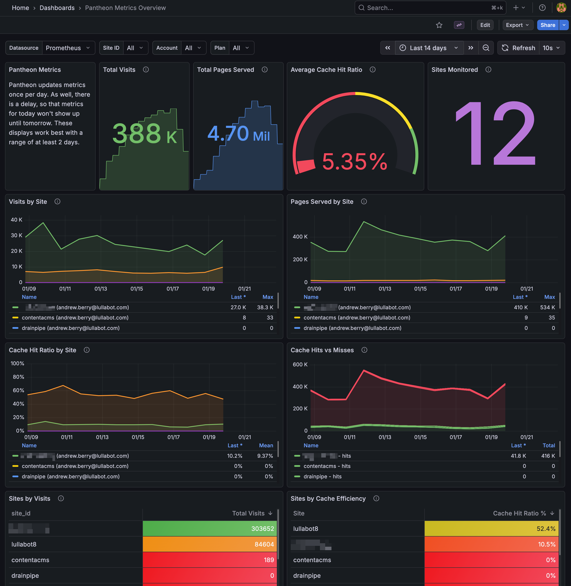

# Pantheon Metrics Prometheus Exporter

A Go application that fetches Pantheon site metrics using the Terminus CLI and exposes them in Prometheus format for scraping. The exporter automatically discovers all sites across multiple Pantheon accounts and collects metrics for each one.



## Build Status

| Workflow | Status |
|----------|--------|
| CI | [](https://github.com/deviantintegral/pantheon-metrics-prometheus/actions/workflows/ci.yml) |
| Release | [](https://github.com/deviantintegral/pantheon-metrics-prometheus/actions/workflows/release.yml) |

## Features

- **Multi-account support**: Monitor sites across multiple Pantheon accounts simultaneously
- **Organization filtering**: Optionally limit metrics to sites from a specific organization
- Exposes metrics via HTTP for Prometheus scraping
- Includes available historical metrics for bootstrapping new installations
- Gracefully handles inaccessible sites and accounts
- Supports monitoring multiple sites in a single exporter instance
- Account-based labeling for distinguishing metrics across accounts
- Debug mode for troubleshooting API requests

### Known Issues

- When Pantheon rebuilds daily metrics, their API returns all zeros. This period of time has been observed to be from 20 to 40 minutes, daily. If you are setting any alerts, consider making them dependent on firing for at least an hour before triggering notifications.

## Prerequisites

- One or more [Pantheon machine tokens](https://docs.pantheon.io/machine-tokens) with at least the "Developer" role in accounts to monitor.
- Prometheus, VictoriaMetrics, or similar tool that can ingest metrics in the [Prometheus Exposition Format](https://prometheus.io/docs/instrumenting/exposition_formats/).
- Grafana or a similar tool to view metrics.

## Installation

### Option 1: Docker Compose (Recommended for Testing)

The easiest way to get started is with Docker Compose, which includes Prometheus and Grafana with a pre-configured dashboard:

```bash
# 1. Copy the environment template
cp .env.example .env

# 2. Edit .env and add your Pantheon machine token(s)
vim .env

# 3. Start all services (exporter, Prometheus, and Grafana)
docker compose up -d
```

Access the services:
- Exporter: http://localhost:8080
- Prometheus: http://localhost:9090
- Grafana: http://localhost:3000 (admin/admin)

The Grafana instance comes with a pre-loaded "Pantheon Metrics Overview" dashboard ready to use!

For detailed Docker documentation, see [DOCKER.md](DOCKER.md).

### Option 2: Download Pre-built Binary

Download the latest release for your platform from the [releases page](https://github.com/deviantintegral/pantheon-metrics-prometheus/releases/latest).

Available for:
- Linux (amd64, arm64)
- macOS (amd64, arm64)
- Windows (amd64, arm64)

```bash
# Example: Download and extract for Linux amd64
wget https://github.com/deviantintegral/pantheon-metrics-prometheus/releases/latest/download/pantheon-metrics-prometheus_VERSION_linux_x86_64.tar.gz
tar -xzf pantheon-metrics-prometheus_VERSION_linux_x86_64.tar.gz
chmod +x pantheon-metrics-exporter
```

### Option 3: Use the Docker/OCI Container

Here is a sample `docker-compose.yaml` snippet:

```yaml
  pantheon-exporter:
    image: ghcr.io/deviantintegral/pantheon-metrics-prometheus:latest
    ports:
      - "8080:8080"
    environment:
      - PANTHEON_MACHINE_TOKENS=<INSERT TOKEN HERE>
    command:
      - "-env=live"
      - "-port=8080"
    restart: unless-stopped
    networks:
      - vm_net
    healthcheck:
      test: ["CMD", "wget", "--no-verbose", "--tries=1", "--spider", "http://localhost:8080/"]
      interval: 30s
      timeout: 10s
      retries: 3
      start_period: 30s
```

### Option 4: Build from Source

```bash
go build -o pantheon-metrics-exporter ./cmd/pantheon-metrics-exporter
```

## Usage

### Setting Up Machine Tokens

The exporter requires Pantheon machine tokens to authenticate. Set the `PANTHEON_MACHINE_TOKENS` environment variable with one or more space-separated tokens:

```bash
# Single account
export PANTHEON_MACHINE_TOKENS="your-machine-token-here"

# Multiple accounts
export PANTHEON_MACHINE_TOKENS="token1 token2 token3"
```

To create a machine token:
1. Log into your Pantheon Dashboard
2. Go to Account > Machine Tokens
3. Click "Create Token"
4. Copy the generated token

### Running the Exporter

```bash
./pantheon-metrics-exporter [options]
```

### Command-Line Flags

| Flag | Default | Description |
|------|---------|-------------|
| `-env` | `live` | Pantheon environment to monitor (e.g., live, dev, test) |
| `-port` | `8080` | HTTP server port for metrics endpoint |
| `-refreshInterval` | `60` | Refresh interval in minutes for updating site lists and metrics |
| `-debug` | `false` | Enable debug logging of HTTP requests and responses to stderr |
| `-siteLimit` | `0` | Maximum number of sites to query (0 = no limit) |
| `-orgID` | `` | Limit metrics to sites from this organization ID (optional, empty = all sites) |

### Examples

```bash
# Export metrics for all sites across all configured accounts
export PANTHEON_MACHINE_TOKENS="token1 token2"
./pantheon-metrics-exporter

# Monitor dev environment
export PANTHEON_MACHINE_TOKENS="your-token"
./pantheon-metrics-exporter -env=dev

# Use a custom port
export PANTHEON_MACHINE_TOKENS="your-token"
./pantheon-metrics-exporter -port=9090

# Refresh data every 30 minutes
export PANTHEON_MACHINE_TOKENS="your-token"
./pantheon-metrics-exporter -refreshInterval=30

# Filter to a specific organization
export PANTHEON_MACHINE_TOKENS="your-token"
./pantheon-metrics-exporter -orgID=your-org-uuid

# Limit to first 10 sites with debug logging
export PANTHEON_MACHINE_TOKENS="your-token"
./pantheon-metrics-exporter -siteLimit=10 -debug
```

## How It Works

### Initial Startup

1. On startup, the exporter reads machine tokens from the `PANTHEON_MACHINE_TOKENS` environment variable
2. For each token, the exporter:
   - Authenticates with the Pantheon API
   - Fetches the site list (optionally filtered by organization ID)
   - Fetches 28 days of metrics for each site
   - Labels all metrics with an account identifier (email or last 8 characters of the token)
3. Sites or accounts that are inaccessible or return errors are logged and skipped
4. Successfully collected metrics from all accounts are aggregated and exposed via the `/metrics` endpoint
5. The exporter shows a summary page at the root URL listing all monitored accounts and sites

### Periodic Refresh

The exporter automatically refreshes data at the interval specified by `-refreshInterval`:

1. **Site List Refresh**: Every refresh interval, the exporter re-fetches the site list for all accounts to detect added or removed sites
2. **Metrics Refresh**: Metrics are refreshed using a queue-based system to prevent API stampedes:
   - Sites are distributed evenly across the refresh interval
   - For example, with 100 sites and a 60-minute interval: 2 sites are processed every minute (100 / 60 = 1.67, rounded up)
   - This ensures steady API usage rather than bursts of requests
   - The queue automatically cycles through all sites continuously
   - Subsequent refreshes fetch only 1 day of metrics to minimize overlap

## Metrics Exposed

The following metrics are exposed for each site:

| Metric | Description |
|--------|-------------|
| `pantheon_visits` | Number of visits |
| `pantheon_pages_served` | Number of pages served |
| `pantheon_cache_hits` | Number of cache hits |
| `pantheon_cache_misses` | Number of cache misses |
| `pantheon_cache_hit_ratio` | Cache hit ratio as percentage |

Each metric includes the following labels:

| Label | Description |
|-------|-------------|
| `name` | Site identifier from Pantheon |
| `label` | Site name (currently same as name) |
| `plan` | Pantheon plan type (e.g., "Performance Small", "Basic") |
| `account` | Account identifier (email or last 8 characters of the machine token) |

## Example Metrics Output

```
# HELP pantheon_visits Number of visits
# TYPE pantheon_visits gauge
pantheon_visits{account="abc12345",label="site1234",name="site1234",plan="Performance Small"} 837 1762732800000
pantheon_visits{account="abc12345",label="site1234",name="site1234",plan="Performance Small"} 824 1762819200000
pantheon_visits{account="def67890",label="site5678",name="site5678",plan="Basic"} 456 1762732800000
pantheon_visits{account="def67890",label="site5678",name="site5678",plan="Basic"} 478 1762819200000

# HELP pantheon_cache_hit_ratio Cache hit ratio as percentage
# TYPE pantheon_cache_hit_ratio gauge
pantheon_cache_hit_ratio{account="abc12345",label="site1234",name="site1234",plan="Performance Small"} 3.86 1762732800000
pantheon_cache_hit_ratio{account="abc12345",label="site1234",name="site1234",plan="Performance Small"} 5.12 1762819200000
```

Note: The timestamps (e.g., 1762732800000) are Unix timestamps in milliseconds, as required by Prometheus for historical metrics.

## Prometheus Configuration

Add the following to your `prometheus.yml` configuration:

```yaml
scrape_configs:
  - job_name: 'pantheon-metrics'
    static_configs:
      - targets: ['localhost:8080']
    # Scrape interval can be frequent since the exporter handles refresh internally
    scrape_interval: 1m
    scrape_timeout: 30s
```

**Note:** With the built-in refresh mechanism, Prometheus can scrape frequently (e.g., every 1 minute) without causing API stampedes. The exporter manages Pantheon API calls internally using the queue-based refresh system.

## Error Handling

The exporter handles errors gracefully:
- Sites that fail to return metrics are logged with a warning and skipped
- The exporter will start successfully as long as at least one site returns metrics
- Individual metric parsing errors are logged but don't prevent other metrics from being collected

## Development

### Running Tests

```bash
go test -v ./...
```

### Code Quality

This project uses [golangci-lint](https://golangci-lint.run/) for code quality checks and linting.

#### Running the Linter

```bash
# Run all linters
golangci-lint run

# Run with auto-fix where possible
golangci-lint run --fix
```

#### Pre-commit Hooks

The project includes pre-commit hooks to automatically run linting and tests before commits. To set up pre-commit hooks:

1. Install [pre-commit](https://pre-commit.com/):
   ```bash
   # Using pip
   pip install pre-commit

   # Or using homebrew (macOS)
   brew install pre-commit
   ```

2. Install the git hooks:
   ```bash
   pre-commit install
   ```

3. (Optional) Run against all files:
   ```bash
   pre-commit run --all-files
   ```

The pre-commit hooks will automatically run:
- `go mod tidy` - Keep dependencies tidy
- `go fmt` - Format code
- `go vet` - Check for suspicious constructs
- `golangci-lint` - Run all configured linters
- `go test` - Run tests with race detector and coverage
- `go build` - Verify the project builds

#### CI/CD

GitHub Actions automatically runs tests, linting, and builds on all pull requests and pushes to main. See:
- `.github/workflows/ci.yml` - Runs tests, linting, and multi-platform builds
- `.github/workflows/release.yml` - Creates releases using GoReleaser
- `.github/workflows/release-please.yml` - Automated release PR creation
- `.github/workflows/conventional-commits.yml` - Validates PR titles and commit messages

### Test Data

Test data is located in the `testdata/` directory:
- `example-metrics.json` - Sample metrics output
- `site-info.json` - Sample site info output
- `site-list.json` - Sample site list output
- `site-config.json` - Legacy configuration format (for backwards compatibility)

## Architecture

The application is organized into the following packages:

### Core Packages

- **`cmd/pantheon-metrics-exporter`**: Entry point and CLI flag parsing
- **`internal/app`**: Main application logic for collecting metrics and setting up HTTP handlers
- **`internal/collector`**: Thread-safe Prometheus collector implementation
- **`internal/pantheon`**: Pantheon API client, data types, and session management
- **`internal/refresh`**: Periodic refresh manager for site lists and metrics

### Key Components

- **Client** (`internal/pantheon/client.go`): Pantheon API client with authentication, site listing, and metrics fetching
- **SessionManager** (`internal/pantheon/session.go`): In-memory session management for authenticated accounts
- **PantheonCollector** (`internal/collector/collector.go`): Thread-safe Prometheus collector for multiple sites across accounts
- **RefreshManager** (`internal/refresh/manager.go`): Manages periodic site list and metrics refresh with queue-based distribution

### Data Types

- **SiteListEntry**: Represents a site from the Pantheon API
- **SiteMetrics**: Holds metrics data for a specific site including account identifier
- **MetricData**: Single metric entry with datetime, visits, pages served, cache stats

### Application Flow

1. **Startup**: Parse CLI flags, read machine tokens, authenticate with each account, fetch site lists
2. **Initial Collection**: Fetch 28 days of metrics for all discovered sites
3. **HTTP Server**: Start server with `/metrics` endpoint and root summary page
4. **Site List Refresh**: Every refresh interval, update the list of monitored sites
5. **Metrics Queue**: Every minute, process a batch of sites for metrics refresh (1 day of data)
6. **Thread Safety**: All collector updates use mutex locks to prevent race conditions

## Troubleshooting

### PANTHEON_MACHINE_TOKENS not set
- Ensure you've set the environment variable before running: `export PANTHEON_MACHINE_TOKENS="token1 token2"`
- Verify it's set: `echo $PANTHEON_MACHINE_TOKENS`

### Authentication failures
- Verify your machine tokens are valid
- Check that tokens haven't expired or been revoked in your Pantheon Dashboard
- Use `-debug` flag to see detailed API request/response logging

### No sites found for an account
- The application will skip accounts with authentication failures
- Check the application logs for warning messages about specific accounts
- Try using `-orgID` to filter to a specific organization

### Metrics not appearing for some sites
- Check the application logs for warning messages
- Verify you have permission to view metrics for those sites
- Use `-debug` flag to troubleshoot API responses
- Some sites may not have metrics available for the specified environment

### Slow startup with multiple accounts
- This is normal when monitoring many accounts and sites
- Each account authentication and each site requires a separate API call
- Use `-siteLimit` to limit the number of sites during testing
- Startup time scales with: (number of accounts) × (average sites per account)

## Contributing

We welcome contributions! This project follows the [Conventional Commits](https://www.conventionalcommits.org/) specification for all pull requests.

### Quick Start

1. Fork the repository
2. Create a new branch for your changes
3. Make your changes and write tests
4. Ensure tests pass: `go test -v ./...`
5. Create a pull request with a conventional commit title

### PR Title Format

Your pull request title must follow this format:

```
<type>[optional scope]: <description>
```

**Examples:**
- `feat: add support for custom metric labels`
- `fix: handle nil pointer in collector refresh`
- `docs: update prometheus configuration examples`
- `refactor(client): simplify authentication flow`

**Allowed types:** `feat`, `fix`, `docs`, `style`, `refactor`, `perf`, `test`, `build`, `ci`, `chore`, `revert`

For detailed contributing guidelines, see [CONTRIBUTING.md](CONTRIBUTING.md).

## License

This project is open source and available for use and modification.
